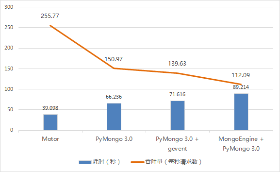
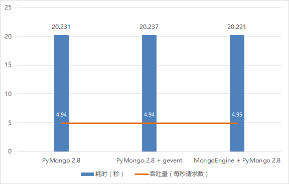
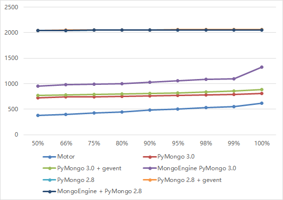

## Tornado MongoDB Performance Test

Tornado 中 MongoDB Drivers：Motor，PyMongo，MongoEngine 的性能测试。测试的全部是**读性能**。

详细的测试说明，请查看这里：

http://www.restran.net/2015/11/03/torando-mongodb-drivers-performance/

## Virtualenv 

由于使用不同的 PyMongo 版本，需要创建2个虚拟环境，pymongo2.8 和 pymongo3.0。

    virtualenv pymongo2.8
    cd pymongo2.8
    source bin/activate
    pip install pymongo==2.8.0 tornado mongoengine motor gevent

    virtualenv pymongo3.0
    cd pymongo3.0
    source bin/activate
    pip install pymongo==3.0.6 tornado mongoengine gevent
    
然后用对应环境的 Python 去启动相应的程序

    /path/to/pymongo2.8/bin/python pymongo2.8_app.py

### 测试1

- 8500 motor
- 8503 pymongo3_app.py
- 8504 pymongo3_gevent_app.py
- 8505 mongoengine_app.py pymongo 3

### 测试2

- 8501 pymongo2.8_app.py
- 8506 pymongo2.8_gevent_app.py
- 8502 mongoengine_app.py pymongo 2.8


## 使用 Apache ab 的测试结果

### 完成所有请求的耗时，吞吐量（每秒处理的请求数）

总共 10000 个请求，每次并发 100 个（同时发送 100 个），使用如下命令

    ab -n 10000 -c 100 http://127.0.0.1:8500/api/posts/query/
    


总共 100 个请求，每次并发 10 个（同时发送 10 个），使用如下命令

    ab -n 100 -c 10 http://127.0.0.1:8500/api/posts/query/



### 百分比请求的最大响应时间

下面两张图，左边坐标的单位是毫秒。例如 Motor 有 50% 的请求是在 376 毫秒内完成的。



PyMongo 2.8，PyMongo 2.8 + gevent，MongoEngine + PyMongo 2.8 三条线重叠在了一起，它们之间的性能相当

### 8500 motor

```
neil@neil-vm:~/Desktop$ ab -n 10000 -c 100 http://192.168.137.140:8500/api/posts/query/
This is ApacheBench, Version 2.3 <$Revision: 1528965 $>
Copyright 1996 Adam Twiss, Zeus Technology Ltd, http://www.zeustech.net/
Licensed to The Apache Software Foundation, http://www.apache.org/

Benchmarking 192.168.137.140 (be patient)
Completed 1000 requests
Completed 2000 requests
Completed 3000 requests
Completed 4000 requests
Completed 5000 requests
Completed 6000 requests
Completed 7000 requests
Completed 8000 requests
Completed 9000 requests
Completed 10000 requests
Finished 10000 requests


Server Software:        TornadoServer/4.2.1
Server Hostname:        192.168.137.140
Server Port:            8500

Document Path:          /api/posts/query/
Document Length:        2858 bytes

Concurrency Level:      100
Time taken for tests:   39.098 seconds
Complete requests:      10000
Failed requests:        0
Total transferred:      30620000 bytes
HTML transferred:       28580000 bytes
Requests per second:    255.77 [#/sec] (mean)
Time per request:       390.977 [ms] (mean)
Time per request:       3.910 [ms] (mean, across all concurrent requests)
Transfer rate:          764.81 [Kbytes/sec] received

Connection Times (ms)
              min  mean[+/-sd] median   max
Connect:        0    1   0.7      0       9
Processing:   140  389  62.0    376     615
Waiting:      140  389  62.0    376     615
Total:        146  390  61.9    376     616
WARNING: The median and mean for the initial connection time are not within a normal deviation
        These results are probably not that reliable.

Percentage of the requests served within a certain time (ms)
  50%    376
  66%    402
  75%    426
  80%    443
  90%    484
  95%    508
  98%    532
  99%    549
 100%    616 (longest request)
```

### 8501 pymongo2.8_app.py

```
neil@neil-vm:~/Desktop$ ab -n 100 -c 10 http://192.168.137.140:8501/api/posts/query/
This is ApacheBench, Version 2.3 <$Revision: 1528965 $>
Copyright 1996 Adam Twiss, Zeus Technology Ltd, http://www.zeustech.net/
Licensed to The Apache Software Foundation, http://www.apache.org/

Benchmarking 192.168.137.140 (be patient).....done


Server Software:        TornadoServer/4.2.1
Server Hostname:        192.168.137.140
Server Port:            8501

Document Path:          /api/posts/query/
Document Length:        2858 bytes

Concurrency Level:      10
Time taken for tests:   20.231 seconds
Complete requests:      100
Failed requests:        0
Total transferred:      306200 bytes
HTML transferred:       285800 bytes
Requests per second:    4.94 [#/sec] (mean)
Time per request:       2023.089 [ms] (mean)
Time per request:       202.309 [ms] (mean, across all concurrent requests)
Transfer rate:          14.78 [Kbytes/sec] received

Connection Times (ms)
              min  mean[+/-sd] median   max
Connect:        0    1   0.3      1       3
Processing:     4 1930 385.9   2040    2061
Waiting:        4 1929 385.8   2039    2060
Total:          5 1930 386.0   2041    2061

Percentage of the requests served within a certain time (ms)
  50%   2041
  66%   2046
  75%   2049
  80%   2049
  90%   2052
  95%   2055
  98%   2060
  99%   2061
 100%   2061 (longest request)
```

### 8502 mongoengine_app.py pymongo 2.8

```
neil@neil-vm:~/Desktop$ ab -n 100 -c 10 http://192.168.137.140:8502/api/posts/query/
This is ApacheBench, Version 2.3 <$Revision: 1528965 $>
Copyright 1996 Adam Twiss, Zeus Technology Ltd, http://www.zeustech.net/
Licensed to The Apache Software Foundation, http://www.apache.org/

Benchmarking 192.168.137.140 (be patient).....done


Server Software:        TornadoServer/4.2.1
Server Hostname:        192.168.137.140
Server Port:            8502

Document Path:          /api/posts/query/
Document Length:        2858 bytes

Concurrency Level:      10
Time taken for tests:   20.221 seconds
Complete requests:      100
Failed requests:        0
Total transferred:      306200 bytes
HTML transferred:       285800 bytes
Requests per second:    4.95 [#/sec] (mean)
Time per request:       2022.121 [ms] (mean)
Time per request:       202.212 [ms] (mean, across all concurrent requests)
Transfer rate:          14.79 [Kbytes/sec] received

Connection Times (ms)
              min  mean[+/-sd] median   max
Connect:        0    1   0.3      1       2
Processing:     6 1930 383.7   2039    2056
Waiting:        6 1930 383.7   2039    2056
Total:          7 1931 383.7   2040    2056

Percentage of the requests served within a certain time (ms)
  50%   2040
  66%   2042
  75%   2048
  80%   2049
  90%   2051
  95%   2054
  98%   2055
  99%   2056
 100%   2056 (longest request)
```

### 8503 pymongo3_app.py

```
neil@neil-vm:~/Desktop$ ab -n 10000 -c 100 http://192.168.137.140:8503/api/posts/query/
This is ApacheBench, Version 2.3 <$Revision: 1528965 $>
Copyright 1996 Adam Twiss, Zeus Technology Ltd, http://www.zeustech.net/
Licensed to The Apache Software Foundation, http://www.apache.org/

Benchmarking 192.168.137.140 (be patient)
Completed 1000 requests
Completed 2000 requests
Completed 3000 requests
Completed 4000 requests
Completed 5000 requests
Completed 6000 requests
Completed 7000 requests
Completed 8000 requests
Completed 9000 requests
Completed 10000 requests
Finished 10000 requests


Server Software:        TornadoServer/4.2.1
Server Hostname:        192.168.137.140
Server Port:            8503

Document Path:          /api/posts/query/
Document Length:        2858 bytes

Concurrency Level:      100
Time taken for tests:   66.236 seconds
Complete requests:      10000
Failed requests:        0
Total transferred:      30620000 bytes
HTML transferred:       28580000 bytes
Requests per second:    150.97 [#/sec] (mean)
Time per request:       662.362 [ms] (mean)
Time per request:       6.624 [ms] (mean, across all concurrent requests)
Transfer rate:          451.45 [Kbytes/sec] received

Connection Times (ms)
              min  mean[+/-sd] median   max
Connect:        0    0   0.4      0       4
Processing:     9  659 116.2    722     805
Waiting:        8  659 116.1    722     804
Total:         10  659 116.0    722     806

Percentage of the requests served within a certain time (ms)
  50%    722
  66%    739
  75%    746
  80%    751
  90%    765
  95%    774
  98%    784
  99%    790
 100%    806 (longest request)
```

### 8504 pymongo3_gevent_app.py

```
neil@neil-vm:~/Desktop$ ab -n 10000 -c 100 http://192.168.137.140:8504/api/posts/query/
This is ApacheBench, Version 2.3 <$Revision: 1528965 $>
Copyright 1996 Adam Twiss, Zeus Technology Ltd, http://www.zeustech.net/
Licensed to The Apache Software Foundation, http://www.apache.org/

Benchmarking 192.168.137.140 (be patient)
Completed 1000 requests
Completed 2000 requests
Completed 3000 requests
Completed 4000 requests
Completed 5000 requests
Completed 6000 requests
Completed 7000 requests
Completed 8000 requests
Completed 9000 requests
Completed 10000 requests
Finished 10000 requests


Server Software:        TornadoServer/4.2.1
Server Hostname:        192.168.137.140
Server Port:            8504

Document Path:          /api/posts/query/
Document Length:        2858 bytes

Concurrency Level:      100
Time taken for tests:   71.616 seconds
Complete requests:      10000
Failed requests:        0
Total transferred:      30620000 bytes
HTML transferred:       28580000 bytes
Requests per second:    139.63 [#/sec] (mean)
Time per request:       716.164 [ms] (mean)
Time per request:       7.162 [ms] (mean, across all concurrent requests)
Transfer rate:          417.54 [Kbytes/sec] received

Connection Times (ms)
              min  mean[+/-sd] median   max
Connect:        0    0   0.6      0      20
Processing:    17  713 115.7    769     886
Waiting:       17  713 115.7    769     886
Total:         19  713 115.6    769     886

Percentage of the requests served within a certain time (ms)
  50%    769
  66%    785
  75%    794
  80%    799
  90%    813
  95%    822
  98%    835
  99%    857
 100%    886 (longest request)
```

### 8505 mongoengine_app.py pymongo 3

```
neil@neil-vm:~/Desktop$ ab -n 10000 -c 100 http://192.168.137.140:8505/api/posts/query/
This is ApacheBench, Version 2.3 <$Revision: 1528965 $>
Copyright 1996 Adam Twiss, Zeus Technology Ltd, http://www.zeustech.net/
Licensed to The Apache Software Foundation, http://www.apache.org/

Benchmarking 192.168.137.140 (be patient)
Completed 1000 requests
Completed 2000 requests
Completed 3000 requests
Completed 4000 requests
Completed 5000 requests
Completed 6000 requests
Completed 7000 requests
Completed 8000 requests
Completed 9000 requests
Completed 10000 requests
Finished 10000 requests


Server Software:        TornadoServer/4.2.1
Server Hostname:        192.168.137.140
Server Port:            8505

Document Path:          /api/posts/query/
Document Length:        2858 bytes

Concurrency Level:      100
Time taken for tests:   89.214 seconds
Complete requests:      10000
Failed requests:        0
Total transferred:      30620000 bytes
HTML transferred:       28580000 bytes
Requests per second:    112.09 [#/sec] (mean)
Time per request:       892.140 [ms] (mean)
Time per request:       8.921 [ms] (mean, across all concurrent requests)
Transfer rate:          335.18 [Kbytes/sec] received

Connection Times (ms)
              min  mean[+/-sd] median   max
Connect:        0    0   0.6      0      11
Processing:    15  887 141.3    951    1330
Waiting:       15  887 141.3    951    1330
Total:         16  888 141.2    951    1331

Percentage of the requests served within a certain time (ms)
  50%    951
  66%    979
  75%    991
  80%   1000
  90%   1034
  95%   1063
  98%   1090
  99%   1101
 100%   1331 (longest request)
```

### 8506 pymongo2.8_gevent_app.py

```
neil@neil-vm:~/Desktop$ ab -n 100 -c 10 http://192.168.137.140:8506/api/posts/query/
This is ApacheBench, Version 2.3 <$Revision: 1528965 $>
Copyright 1996 Adam Twiss, Zeus Technology Ltd, http://www.zeustech.net/
Licensed to The Apache Software Foundation, http://www.apache.org/

Benchmarking 192.168.137.140 (be patient).....done


Server Software:        TornadoServer/4.2.1
Server Hostname:        192.168.137.140
Server Port:            8506

Document Path:          /api/posts/query/
Document Length:        2858 bytes

Concurrency Level:      10
Time taken for tests:   20.237 seconds
Complete requests:      100
Failed requests:        0
Total transferred:      306200 bytes
HTML transferred:       285800 bytes
Requests per second:    4.94 [#/sec] (mean)
Time per request:       2023.711 [ms] (mean)
Time per request:       202.371 [ms] (mean, across all concurrent requests)
Transfer rate:          14.78 [Kbytes/sec] received

Connection Times (ms)
              min  mean[+/-sd] median   max
Connect:        0    1   1.4      1      13
Processing:     7 1931 385.2   2041    2060
Waiting:        7 1931 385.2   2041    2059
Total:          8 1932 385.4   2042    2060

Percentage of the requests served within a certain time (ms)
  50%   2042
  66%   2048
  75%   2049
  80%   2050
  90%   2054
  95%   2058
  98%   2060
  99%   2060
 100%   2060 (longest request)
```